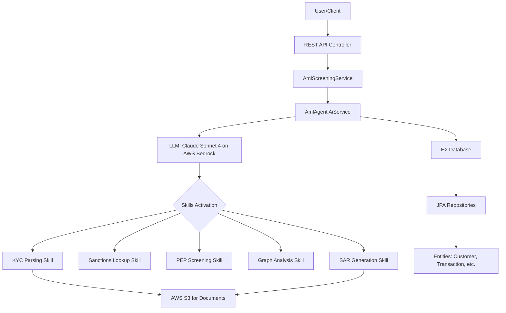

# AML Screening Agent — POC

## Table of Contents

- [Description](#description)
- [Architecture](#architecture)
- [Prerequisites](#prerequisites)
- [Installation](#installation)
- [Configuration](#configuration)
- [Usage](#usage)
- [API Reference](#api-reference)
- [Testing](#testing)
- [Contributing](#contributing)
- [Get In Touch](#get-in-touch)

## Description

This Proof of Concept (POC) implements an Anti-Money Laundering (AML) Screening Agent using Agentic AI. The solution automates customer screening by integrating multiple skills: KYC document parsing, sanctions list lookup, Politically Exposed Persons (PEP) screening, transaction graph analysis, and Suspicious Activity Report (SAR) generation. Built with Java 21, Spring Boot 3.4.4, LangChain4j 1.13.0-beta23, and powered by AWS Bedrock's Claude Sonnet 4 model, it provides a RESTful API for seamless integration into financial systems.

## Architecture

The architecture leverages a skills-based agentic AI approach where the LLM dynamically activates specialized skills based on the screening requirements.



### Key Components:
- **AmlController**: Handles REST API requests
- **AmlScreeningService**: Orchestrates the screening process
- **AmlAgent**: LangChain4j AiService that manages skill activation
- **Skills**: Modular tools for specific AML tasks (defined in `resources/skills/`)
- **Data Layer**: JPA entities and repositories for persistence
- **AWS Integration**: Bedrock for AI inference, S3 for document storage

## Prerequisites

- Java 21 or higher
- Maven 3.6+
- AWS Account with access to Bedrock and S3 services
- (Optional) Docker for containerized deployment

## Installation

1. Clone the repository:
   ```bash
   git clone https://github.com/amolmandlik/aml-screening-agent.git
   cd aml-screening-agent
   ```

2. Build the project:
   ```bash
   mvn clean install
   ```

3. Run the application:
   ```bash
   mvn spring-boot:run
   ```

The application will start on `http://localhost:8080`.

## Configuration

### Application Configuration
The main configuration is in `src/main/resources/application.yaml`. Key settings include:
- Database: H2 in-memory for POC
- AWS Region: Configurable via `application.yaml`

### AWS Credentials Setup

The app uses `DefaultCredentialsProvider` — set credentials via any standard AWS method:

```bash
# Option A: Environment variables
export AWS_ACCESS_KEY_ID=your_key
export AWS_SECRET_ACCESS_KEY=your_secret
export AWS_DEFAULT_REGION=us-east-1

# Option B: AWS CLI (recommended)
aws configure

# Option C: IAM Role on EC2/EKS (recommended for production)
# No config needed — SDK picks up instance metadata automatically
```

### Required IAM Permissions
```json
{
  "Version": "2012-10-17",
  "Statement": [
    {
      "Effect": "Allow",
      "Action": ["bedrock:InvokeModel", "bedrock:InvokeModelWithResponseStream"],
      "Resource": "arn:aws:bedrock:us-east-1::foundation-model/anthropic.claude-sonnet-4-0"
    },
    {
      "Effect": "Allow",
      "Action": ["s3:GetObject", "s3:PutObject", "s3:HeadObject"],
      "Resource": "arn:aws:s3:::aml-kyc-documents-poc/*"
    }
  ]
}
```

## Usage

### How the Skills API Works

The AML Screening Agent uses a skills-based approach where the LLM dynamically activates specialized skills based on the screening requirements. Below is the flow:

```
User Request → AmlController
                    ↓
            AmlScreeningService.screenCustomer()
                    ↓
            AmlScreeningAgent.screenCustomer(prompt)   ← LangChain4j AiService
                    ↓
        ┌─────────────────────────────────────────────────────────┐
        │  LLM (Claude Sonnet 4 on AWS Bedrock)                   │
        │                                                         │
        │  [Only activate_skill is visible initially]             │
        │                                                         │
        │  1. activate_skill("kyc-parsing")                       │
        │     → SKILL.md instructions loaded into context         │
        │     → fetchKycDocumentText(), recordKycParsingResult()  │
        │       now become visible                                │
        │                                                         │
        │  2. activate_skill("sanctions-lookup")                  │
        │     → searchSanctionsList(), recordSanctionsResult()    │
        │       become visible                                    │
        │                                                         │
        │  3. activate_skill("pep-screening")                     │
        │     → searchPepRegistry(), checkEddTriggers()           │
        │       become visible                                    │
        │                                                         │
        │  4. activate_skill("graph-analysis")                    │
        │     → getRecentTransactions(), checkVelocity(),         │
        │       recordGraphAnalysisResult() become visible        │
        │                                                         │
        │  5. [IF risk >= 60 or HIGH sanctions/PEP hit]           │
        │     activate_skill("sar-generation")                    │
        │     → generateSarReferenceNumber(), storeSarReport()    │
        │       become visible → SAR saved to DB + S3             │
        └─────────────────────────────────────────────────────────┘
                    ↓
            AmlScreeningResponse returned to caller
```

---

## API Reference

| Method | Endpoint | Description |
|--------|----------|-------------|
| `POST` | `/api/v1/aml/screen/{customerId}` | Run full AML screening (triggers agent) |
| `GET`  | `/api/v1/aml/customers` | List all customers |
| `POST` | `/api/v1/aml/customers/{id}/kyc-document` | Upload KYC PDF to S3 |
| `GET`  | `/api/v1/aml/sar/{customerId}` | Get all SARs for a customer |
| `GET`  | `/api/v1/aml/sar/reference/{ref}` | Get SAR by reference number |
| `GET`  | `/api/v1/aml/sar/download/{ref}` | Get pre-signed S3 download URL |

## Testing

### Running Unit Tests
```bash
mvn test
```

## Contributing

Contributions are welcome! Please follow these steps:

1. Fork the repository
2. Create a feature branch (`git checkout -b feature/amazing-feature`)
3. Commit your changes (`git commit -m 'Add some amazing feature'`)
4. Push to the branch (`git push origin feature/amazing-feature`)
5. Open a Pull Request

## Get In Touch

If you're interested in implementing this AML Screening Agent solution or any similar agentic AI-based compliance solutions for your organization, we'd love to hear from you!

**Contact Information:**
- **GitHub:** [@AmolMandlik](https://github.com/AmolMandlik)
- **Email:** [mandlikamol550@gmail.com](mailto:mandlikamol550@gmail.com)

Whether you need custom implementation, integration support, or want to discuss how agentic AI can revolutionize your compliance workflows, please feel free to connect. We're open to collaborations, consultations, and enterprise implementations.

---

**Let's build intelligent compliance solutions together!** 🚀
